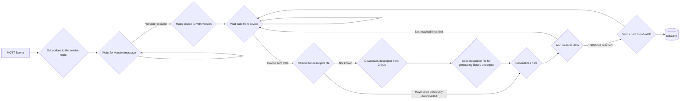

# Influx Logger: Securely Collecting and Storing Telemetry Data

**Influx Logger** acts as a secure data collection and storage solution for telemetry devices. It seamlessly integrates with InfluxDB, a popular time-series database, offering efficient storage and analysis of real-time data.

## Functionality

Influx Logger performs the following tasks:

* **Secure and reliable data collection:** Utilizes the MQTT protocol to establish secure communication with connected telemetry devices.
* **Version-aware handling:** Adapts to different device versions by dynamically retrieving corresponding descriptor files.
* **Efficient data storage:** Leverages InfluxDB for optimized storage and retrieval of time-series data.
* **Scalable architecture:** Designed to handle large volumes of data from numerous devices.

## Procedure

Here's a step-by-step breakdown of Influx Logger's operation:

1. **MQTT Connection and Subscription:**
    - Establishes a connection to the MQTT server.
    - Subscribes to all relevant data topics used by telemetry devices.

2. **Version Identification:**
    - Waits for a special "version message" from each connected device.
    - This message contains a unique identifier indicating the specific version of the CAN library used by the device.

3. **Device Version Mapping:**
    - Upon receiving the version message, maps the device ID with its corresponding library version.
    - This mapping allows for effective handling of devices with different versions.
    - The version message is typically flagged with a "retention" bit, ensuring it's sent only once upon device connection or reconnection.

4. **Protobuf Deserialization:**
    - Telemetry devices continuously transmit collected data in Protobuf format, the default encoding method.
    - The logger requires the corresponding descriptor file to decode this data.
    - If the descriptor file for a specific version is unavailable, the logger retrieves it from a designated location on GitHub, based on the version information received earlier.
    - Once retrieved, the descriptor file is stored internally for future use.
    - Using the appropriate schema, the logger efficiently deserializes the received data.

5. **Data Accumulation and InfluxDB Integration:**
    - Accumulates received data points and constructs InfluxDB insert statements incrementally.
    - To optimize database performance, sends data in batches of 1000 lines (measurements) to InfluxDB using HTTP requests.



## Usage

To install dependencies:

```bash
bun install
```

To run:

```bash
bun run index.ts
```
