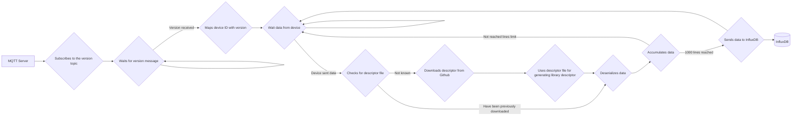

# Influx Logger: Securely Collecting and Storing Telemetry Data

## Description
**Influx Logger** is a middleware beetween Telemetry and Influx which main purpose is to log data in the database.
It takes data sent on the MQTT broker, deserialze them with protobuffer and insert them in Influx.

### Functionality

Here's a step-by-step breakdown of Influx Logger's operation:

1. **MQTT Connection and Subscription:**
    - Establishes a connection to the MQTT server.
    - Subscribes to all relevant data topics used by telemetry devices.

2. **Version Identification:**
    - Waits for a special "version message" from each connected device.
    - This message contains a unique identifier indicating the specific version of the CAN library used by the device.

3. **Device Version Mapping:**
    - Upon receiving the version message, maps the device ID with its corresponding library version.
    - This mapping allows for effective handling of devices with different versions.
    - The version message is typically flagged with a "retention" bit, ensuring it's sent only once upon device connection or reconnection.

4. **Protobuf Deserialization:**
    - Telemetry devices continuously transmit collected data in Protobuf format, the default encoding method.
    - The logger requires the corresponding descriptor file to decode this data.
    - If the descriptor file for a specific version is unavailable, the logger retrieves it from a designated location on GitHub, based on the version information received earlier.
    - Once retrieved, the descriptor file is stored internally for future use.
    - Using the appropriate schema, the logger efficiently deserializes the received data.

5. **Data Accumulation and InfluxDB Integration:**
    - Accumulates received data points and constructs InfluxDB insert statements incrementally.
    - To optimize database performance, sends data in batches of lines (measurements) to InfluxDB using HTTP requests.


```mermaid
flowchart LR
    A[MQTT Server] --> B{Subscribes to the version topic}
    B --> C{Waits for version message}
    C --> C
    C -->|Version received| E{Maps device ID with version}
    E --> F{Wait data from device}
    F --> F
    F --> |Device sent data| G{Checks for descriptor file}
    G -->|Not known| I{Downloads descriptor from Github}
    I --> H{Uses descriptor file for generating library descriptor}
    G -->|Have been previously downloaded| J
    H --> J{Deserializes data}
    J --> K{Accumulates data}
    K -->|1000 lines reached| L{Sends data to InfluxDB}
    K -->|Not reached lines limit| F
    L --> M[(InfluxDB)]
    L --> F
```

## Usage
### Configuration File
In order to execute the program a *json* configuration file is required.
It should be written like this:
```json
{
    "mqtt_url" : "mosquitto",
    "mqtt_port" : "1883",
    "influx_url" : "influxdb",
    "influx_port" : "8086",
    "influx_token" : "token_given_by_the_influx_administrator",
    "influx_org" : "eagletrt",
    "influx_bucket" : "telemetry"
}
```
### Python
#### Requirements
In order to use python to execute the program you need to install the following dependecies:
```sh
pip install paho-mqtt requests python_http_client protobuf grpcio-tools influxdb-client python-statemachine pydot
```
#### Execution
To execute the program run:
```sh
python3 -m src.main
```
It takes as argument the configuration *json* file you want to use.
By default *config.json* is taken in input.
### Docker
An alternative to bare Python execution is execution through Docker.
A Dockerfile is provided in this repository with all the requirements satisfied which allows to execute the program properly.
It requires the bind mount of a configuration file.
In the following commands the host machine configuration file provided to docker is called *configuration.json*.
```sh
docker build --secret id=manager-config,src=$(pwd)/configuration.json -f Dockerfile.manager.yml -t influx-manager:latest .
```
```sh
docker run --mount=type=bind,src=$(pwd)/configuration.json,target=/app/config.json,readonly manager:latest
```
#### Tests
For tests purpose can be useful to run Influx and Mosquitto on Docker with Influx Manager, to do so this repository provide a *docker-compose.yml* file which creates such system.
You must first execute it once and retrives the Influxdb token from https://localhost:8086, than place the token in a configuration file named *configuration.json*, than you can properly 
run tests using mosquitto at port 8883 (change the port in the configuration file).
To run the docker compose file use:
```sh
docker compose up --build --remove-orphans
```
