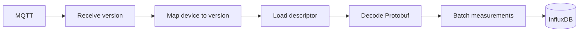

# Influx Logger

Influx Logger is the telemetry middleware used by E-Agle Trento Racing Team. It
subscribes to MQTT topics, decodes Protobuf messages, and stores the resulting
measurements in InfluxDB.

## How it works

1. Connects to MQTT and subscribes to telemetry topics.
2. Associates each device with the CAN library version reported in its version
   message.
3. Downloads and caches the matching Protobuf descriptor from GitHub when
   needed.
4. Decodes telemetry messages and batches them into InfluxDB line protocol
   writes.


```mermaid
flowchart LR
    A[MQTT] --> B[Receive version]
    B --> C[Map device to version]
    C --> D[Load descriptor]
    D --> E[Decode Protobuf]
    E --> F[Batch measurements]
    F --> G[(InfluxDB)]
```

## Configuration

The application reads `config.json` by default. A different file can be passed
as the first command-line argument.

```json
{
  "mqtt": {
    "url": "mosquitto",
    "port": 1883,
    "username": "optional_username",
    "password": "optional_password",
    "client_id": "influx-logger-optional123"
  },
  "influx": {
    "url": "influxdb",
    "port": 8086,
    "token": "influx_token",
    "org": "eagletrt",
    "buckets": {
      "adr": "telemetry_adr",
      "logs": "telemetry_log"
    }
  },
  "vehicle_whitelist": ["kraken"],
  "github_token": "optional_github_personal_access_token",
  "log_on_mqtt": "kraken/onboard/info/status/influx-logger",
  "excluded_networks": ["odometer"]
}
```

## Running locally

Influx Logger requires Python 3.12 or newer. Install the project and its
dependencies with:

```sh
pip install .
```

Then start the logger:

```sh
python3 -m src.main
```

To use another configuration file:

```sh
python3 -m src.main path/to/configuration.json
```

## Running with Docker

Build the image and mount the configuration and descriptor cache:

```sh
docker build \
  --secret id=logger-config,src="$(pwd)/configuration.json" \
  -f Dockerfile.influx-logger.yml \
  -t influx-logger:latest .

docker run \
  --mount type=bind,src="$(pwd)/configuration.json",target=/app/config.json,readonly \
  --mount type=bind,src="$(pwd)/cache",target=/app/cache \
  influx-logger:latest
```

## Tests

The test Compose environment starts InfluxDB, Mosquitto, and Influx Logger.
Create `configuration.json` with the InfluxDB token generated by the InfluxDB
setup, then run:

```sh
docker compose -f compose.test.yml up --build --remove-orphans
```
